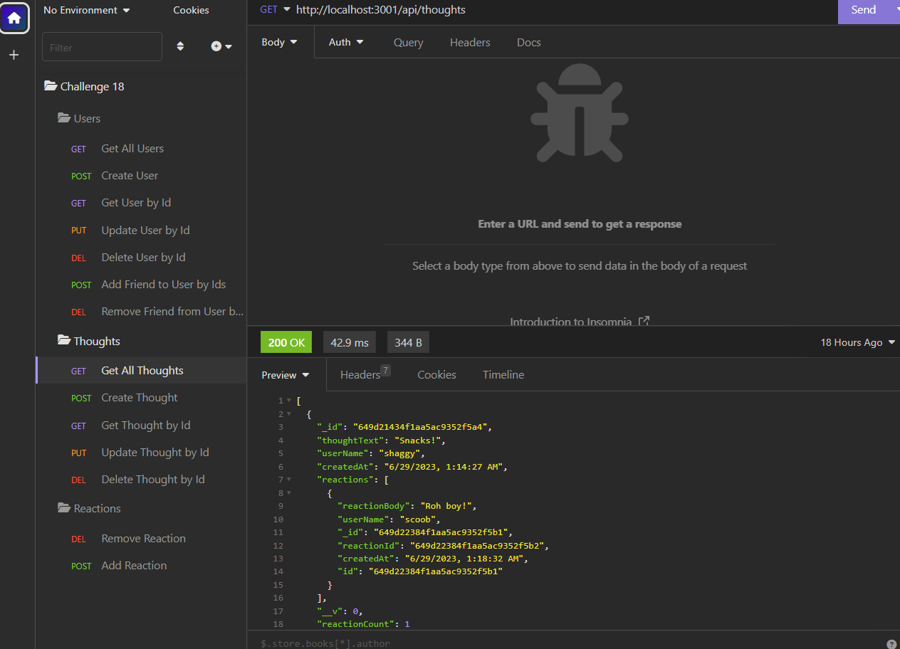

# NoSQL Social Network API

[Link to video walkthrough](https://drive.google.com/file/d/1rjhTaKI-taKozNvKC-l5tHJPlta0VvSH/view)

## Description
This app is a sample back end for a social network website wherein users can make CRUD calls to a database using Insomnia. In this test app, users can create sample users, posts, and comments for this hypothetical social media site.

## Screenshot


## Installation
N/A

## Usage
* Download the program files to computer.
* Open the NoSQL Social Network API folder in the CLI. 
* To initialize the program, use the command `npm run start`
* You'll be notified the server is running. 
* Use Insomnia to make GET, POST, PUT, and DELETE functions. 
* Use the routes and formats below for database operations.

### Get All Users and Create User Route
* Path: /api/users
* Format for request body: 
```json
{
  "userName": "mario",
  "email": "redplumber@mkingdom.com"
}
```

### Get User by Id and Update User by Id Route
* Path: /api/users/:userId
* Format for request body: 
```json
{
  "userName": "mario",
  "email": "redplumber@mkingdom.com"
}
```

### Add Friend or Remove Friend by Id Route
* Path: /api/users/:userId/friends/:friendId

### Get All Thoughts and Create Thought Route
* Path: /api/thoughts
* Format for request body: 
```json
{
  "thoughtText": "Mamma Mia!",
  "userName": "mario",
  "userId": "1983"
}
```

### Get, Update, and Delete Thought by Id Route
* Path: /api/thoughts/:thoughtId
* For delete, no request body is required
* Format for request body:
```json
{
  "thoughtText": "Mamma Mia!",
  "userName": "mario",
  "userId": "1983"
}
```

### Add and Remove Reaction Route
* Path: /api/thoughts/:thoughtId/reactions
* Format for request body to Add Reaction:
```json
{
  "reactionBody": "Mario?",
  "userName": "luigi"
}
```
* Format for request body to Remove Reaction: 
```json
{
  "reactionId": "2001"
}
```
## References
* Referenced Mini Project code from Unit 18
* [Referenced for validating email](https://blog.bounceless.io/validating-email-with-mongoose/)
* [Referenced for formatting date](https://stackoverflow.com/questions/14638018/current-time-formatting-with-javascript)

## License
Please refer to the license in the repo.
- - -


